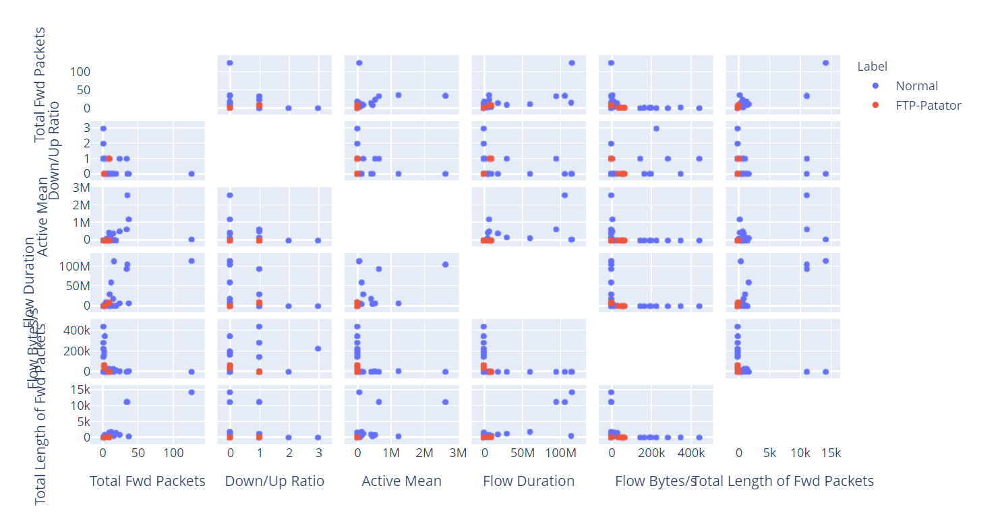
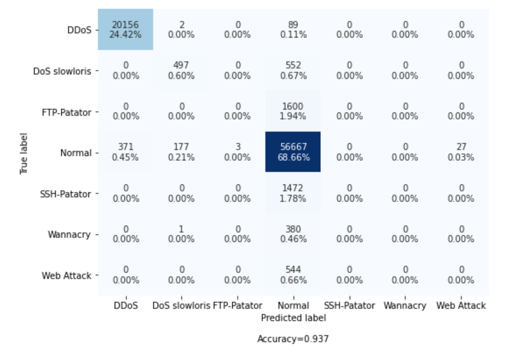
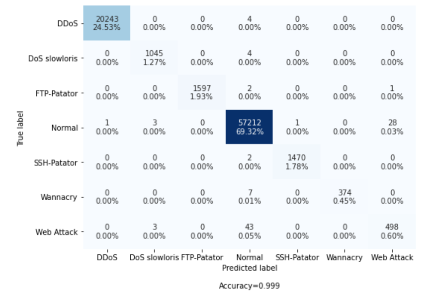

# A-Machine-Learning-approach-on-Malware-Classification.
## Python libraries used:
- Pandas
- Numpy
- sklearn
- plotly
- seaborn
- scipy
## Project description
This project is an attempt to analyse and classify malicious network traffic by using machine learning techniques. The features used for this task are extracted from network flows which is a bidirectional stream of network packets. The network traffic in the dataset was captured using wireshark and tcpdump and was further processed by using CICflowmeter. We selected specific types of malicious traffic such as:
- DDoS attack
- FTP-patator
- SSH-patator
- Dos slowloris
- Wannacry

Our task is to distinguish them from normal network traffic and also classify them by their respected classes. Using the **scikit-learn** python module we trained 3 different machine learning algorithms:
- KNN
- SVM
- Random forest

## Methodology
- Training / testing dataset split: we have chosen to use the stratified K-fold split since our dataset is quite imbalanced.

- Feature selection: We removed the features with low variance using a corellation matrix with a given threshold and we determined the following features are the most appropriate:
- Total FWD packets
- Down/Up Ration
- Active Mean
- Flow Duration
- Flow Bytes
- Total length of FWD packets
- BWD packet length max
- FWD packe length max
- INIT win bytes backward
- INIT win bytes forward
- Flow IAT mean

##Results

- KNN

- SVM

- Random forest

